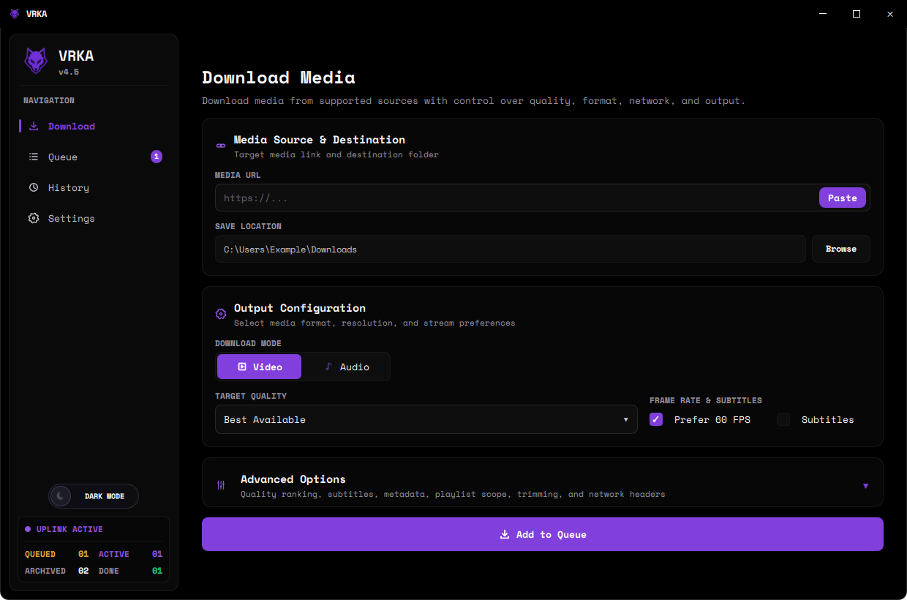
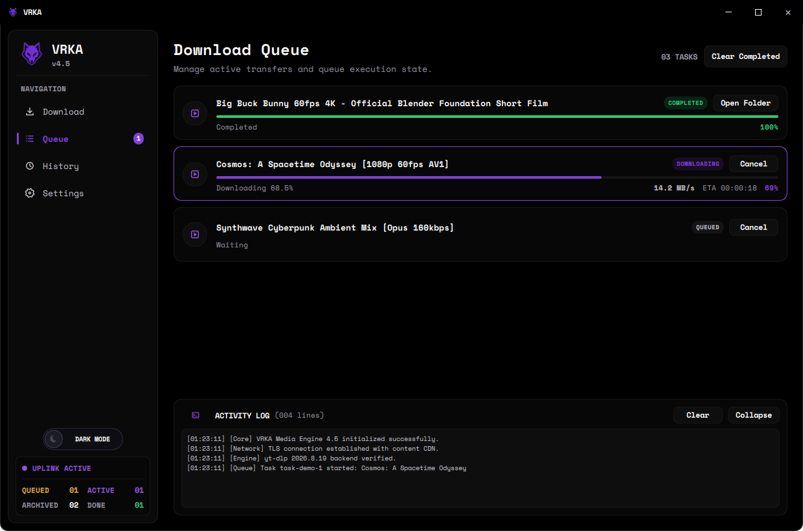
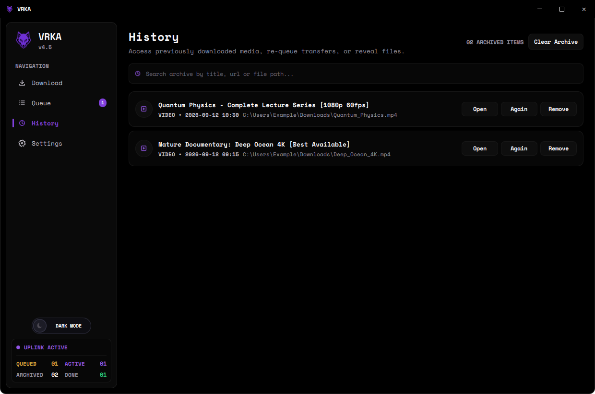
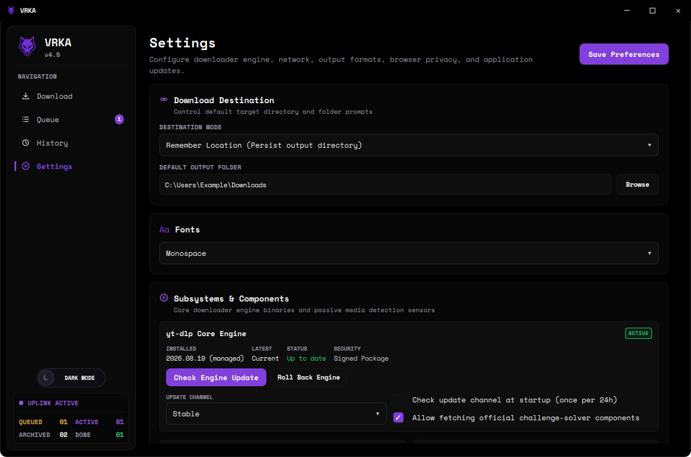

<div align="center">
  
  <h1>VRKA</h1>
  <p><strong>A modern, lightweight desktop media downloader for Windows.</strong></p>

  <p>
    <a href="https://github.com/MaverickRox/VRKA/releases/latest"></a>
    <a href="https://github.com/MaverickRox/VRKA/releases"></a>
    <a href="LICENSE"></a>
    <a href="https://github.com/MaverickRox/VRKA/issues"></a>
  </p>

  <p>
    <a href="https://github.com/MaverickRox/VRKA/releases/latest"><b>Download VRKA 4.5</b></a> •
    <a href="docs/USER_GUIDE.md">User Guide</a> •
    <a href="docs/ARCHITECTURE_OVERVIEW.md">Architecture</a> •
    <a href="https://github.com/MaverickRox/VRKA/issues/new/choose">Report Issue</a> •
    <a href="SECURITY.md">Security</a>
  </p>
</div>

<br />

<div align="center">
  
</div>

---

## Download VRKA 4.5

Get the official Windows release from [GitHub Releases (v4.5.0)](https://github.com/MaverickRox/VRKA/releases/tag/v4.5.0):

| Package | Filename | Recommended For | Description |
| :--- | :--- | :--- | :--- |
| **[Windows Installer](https://github.com/MaverickRox/VRKA/releases/tag/v4.5.0)** | `VRKA-4.5.0-Build-018-Setup.exe` | Most Users | Standard setup wizard with Start Menu and Desktop shortcuts. |
| **[Portable ZIP](https://github.com/MaverickRox/VRKA/releases/tag/v4.5.0)** | `VRKA-4.5.0-Build-018-Portable.zip` | USB / Portable | Standalone directory — extract anywhere and run `VRKA.exe`. |
| **[Single-File Portable EXE](https://github.com/MaverickRox/VRKA/releases/tag/v4.5.0)** | `VRKA-4.5.0-Build-018-Portable.exe` | Lightweight Run | Single-file executable. Provisions managed runtime on first use. |
| **[Complete Source Archive](https://github.com/MaverickRox/VRKA/releases/tag/v4.5.0)** | `VRKA-4.5.0-Build-018-Source.zip` | Developers | Complete buildable source distribution snapshot. |

> **No Manual FFmpeg Installation Required**:
> VRKA is strictly PATH-independent. The application automatically provisions and verifies required media processing components in `%LOCALAPPDATA%\VRKA\runtime\` upon first video merge or audio extraction, and reuses them offline on subsequent runs.

### Verifying Checksums

Every release provides a `SHA256SUMS.txt` manifest and detached OpenPGP signatures (`SHA256SUMS.txt.asc`). Verify your download in PowerShell:

```powershell
Get-FileHash .\VRKA-4.5.0-Build-018-Setup.exe -Algorithm SHA256
```

---

## What is VRKA?

VRKA is a clean, modern desktop media downloader designed for single-stream and batch downloads on Windows 10 and 11. Built with a native **Qt 6 QML** interface and a resilient Python backend, VRKA combines multi-factor quality selection powered by [yt-dlp](https://github.com/yt-dlp/yt-dlp) with an automated, passive **Browser Fallback** subsystem for sites that require browser-assisted stream observation.

VRKA is entirely self-contained, ad-free, and respects your privacy with zero background services and zero telemetry.

---

## Features

- **Modern Frameless Desktop Experience**: Custom Windows title bar with native snap layout compatibility, edge/corner resizing, double-click maximize, and drag controls.
- **Multi-Factor Quality Ranking**: Deterministic evaluation of resolution, framerate (up to 60 FPS), video bitrate, container compatibility, and codec efficiency (never choosing a newer codec over a higher-fidelity source stream).
- **Responsive Qt 6 QML Interface**: Hardware-accelerated UI with fluid animations, adaptive typography switcher (Monospace vs System Default), and integrated Day/Night theme toggle.
- **Audio Extraction & Transcoding**: Extract audio in MP3 (320, 256, 192, 128 kbps), Opus, or uncompressed WAV formats.
- **Flexible Destination Modes**: Choose between "Remember Location" (persisting chosen folder) or "Ask Every Time" (per-download location prompt).
- **Advanced Network & Custom Headers**: Strict RFC 7230 header validation, CRLF/newline injection rejection, and automated secret scrubbing from logs.
- **In-App Application & Engine Updater**: Direct in-app updates with rate-limited GitHub release checks, SHA-256 integrity verification, and atomic staging.
- **Durable Task Queue**: Reliable single-worker FIFO scheduling with persistent state storage—downloads resume cleanly across application restarts.
- **Passive Browser Fallback & Session Purge**: Isolated WebView2 session passively detects HLS/DASH media with built-in uBlock Origin Lite protection, with instant session data clearing in Settings.
- **Sanitized Diagnostics**: Export redacted diagnostic reports for troubleshooting without leaking credentials or private session data.

---

## User Interface Tour

<details open>
<summary><b>Task Queue & Execution Pipeline</b></summary>
<br />
<div align="center">
  
  <p><i>Real-time task monitoring with multi-line activity logging, progress metrics, and state management.</i></p>
</div>
</details>

<details>
<summary><b>Completed Downloads History</b></summary>
<br />
<div align="center">
  
  <p><i>Archived transfer history with direct file reveal, instant re-download prefill, and search.</i></p>
</div>
</details>

<details>
<summary><b>Engine Runtime & Configuration</b></summary>
<br />
<div align="center">
  
  <p><i>In-app engine updates with rollback protection, authentication session management, and proxy configuration.</i></p>
</div>
</details>

---

## Installation

### Using the Setup Installer (Recommended)

1. Download `VRKA-4.5.0-Build-018-Setup.exe` from [Releases](https://github.com/MaverickRox/VRKA/releases/latest).
2. Run the installer and follow the setup steps.
3. Launch VRKA from the Start Menu or Desktop shortcut.

### Using Portable Mode

1. Download `VRKA-4.5.0-Build-018-Portable.zip`.
2. Extract the archive to any folder or USB drive.
3. Run `VRKA.exe`. All settings are stored locally, and no administrative privileges are required.

---

## Building from Source

### Prerequisites

- Windows 10 / 11 x64
- Python 3.10, 3.11, or 3.12
- Git

### Setup & Run

```powershell
# Clone the repository
git clone https://github.com/MaverickRox/VRKA.git
cd VRKA

# Set up an isolated virtual environment
python -m venv .venv
.\.venv\Scripts\Activate.ps1

# Install project dependencies
pip install -r requirements.txt

# Run the application
python vrka_qml_app.py
```

### Running Tests

```powershell
# Run the test suite
python -m unittest discover -s tests -v
```

### Compiling Standalone Binary

```powershell
# Build standalone VRKA.exe with PyInstaller
pip install pyinstaller
pyinstaller VRKA-Windows.spec
```

---

## Privacy & Security

VRKA is built on principles of user privacy and transparency:
- **Zero Telemetry**: VRKA does not collect, transmit, or monetize any analytics, metrics, or personal data.
- **Local Operation**: All task databases, settings, and temporary files remain strictly on your local machine (`%USERPROFILE%\.vrka`).
- **Redacted Logging**: Authentication cookies, session tokens, and sensitive URL query parameters are automatically redacted from activity logs.
- **DRM Non-Circumvention**: VRKA does not bypass Widevine, FairPlay, PlayReady, or any Digital Rights Management systems.

For full details, read [PRIVACY.md](PRIVACY.md) and [SECURITY.md](SECURITY.md).

---

## Responsible Use

VRKA is intended for downloading user-authorized content, creative commons media, personal recordings, and openly accessible streams. Users are responsible for complying with applicable copyright laws and the terms of service of the content platforms they access.

For more information, see [DISCLAIMER.md](DISCLAIMER.md).

---

## Documentation

- [User Guide](docs/USER_GUIDE.md) — Comprehensive guide to downloading, formats, and settings.
- [Architecture Overview](docs/ARCHITECTURE_OVERVIEW.md) — Overview of the Qt Quick frontend and Python backend design.
- [Building from Source](docs/BUILD_FROM_SOURCE.md) — In-depth guide for building and packaging VRKA on Windows.
- [Troubleshooting](docs/TROUBLESHOOTING.md) — Solutions to common issues and network configuration questions.
- [FFmpeg Compliance](docs/FFMPEG_COMPLIANCE.md) — Notes on media toolchain integration.

---

## Support & Contributing

- **Questions & Troubleshooting**: Check the [User Guide](docs/USER_GUIDE.md) or open a discussion in [Support](SUPPORT.md).
- **Bug Reports & Feature Requests**: Submit an issue via [GitHub Issues](https://github.com/MaverickRox/VRKA/issues/new/choose).
- **Contributing**: Contributions and code improvements are welcome. Please read [CONTRIBUTING.md](CONTRIBUTING.md) and our [Code of Conduct](CODE_OF_CONDUCT.md).

---

## License

VRKA is licensed under the [GNU General Public License v3.0 or later (GPL-3.0-or-later)](LICENSE).

Third-party dependencies and their respective licenses are documented in [THIRD_PARTY_NOTICES.md](THIRD_PARTY_NOTICES.md) and the [LICENSES/](LICENSES/) directory.
